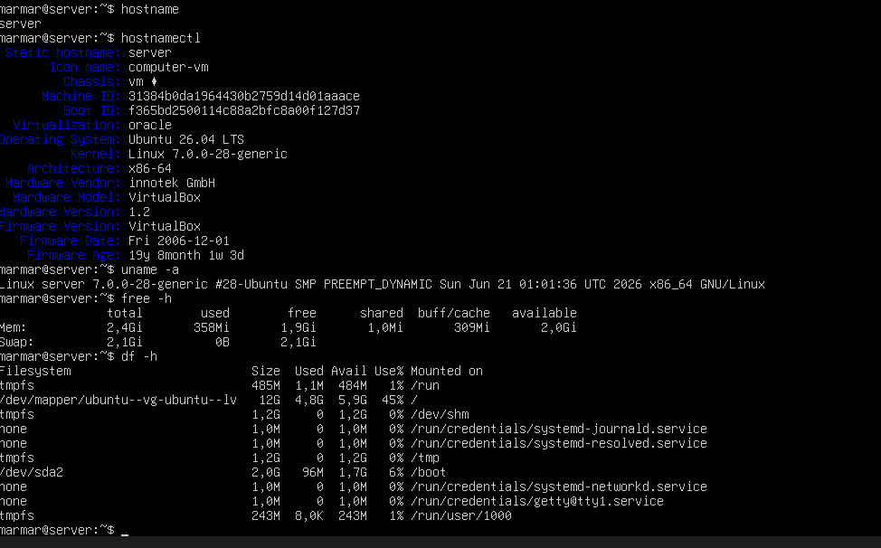
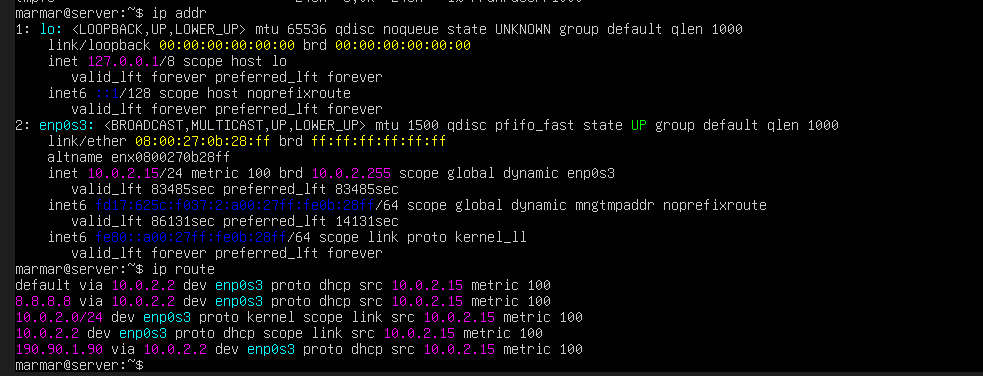
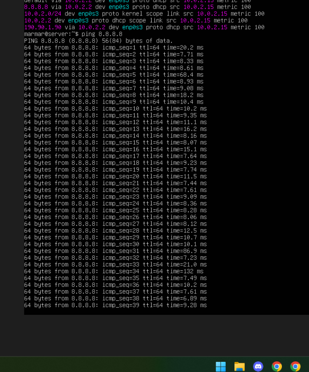
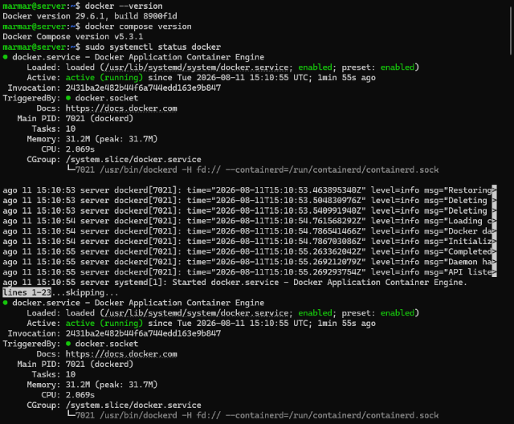
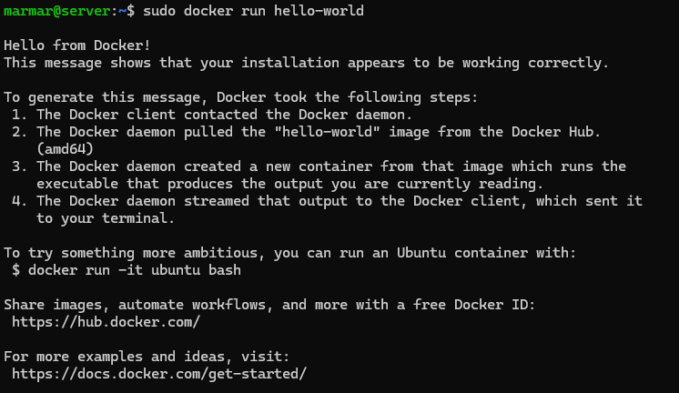
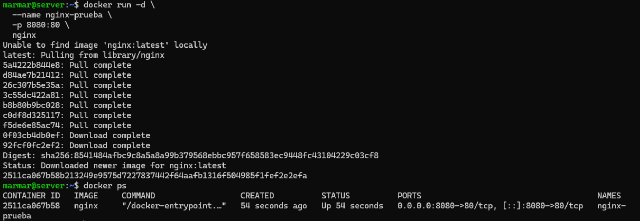
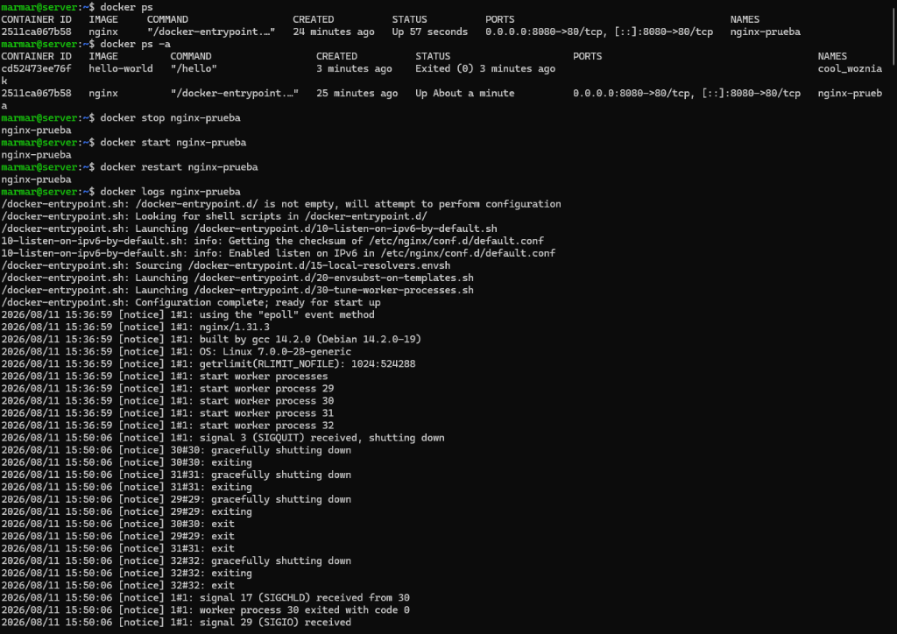
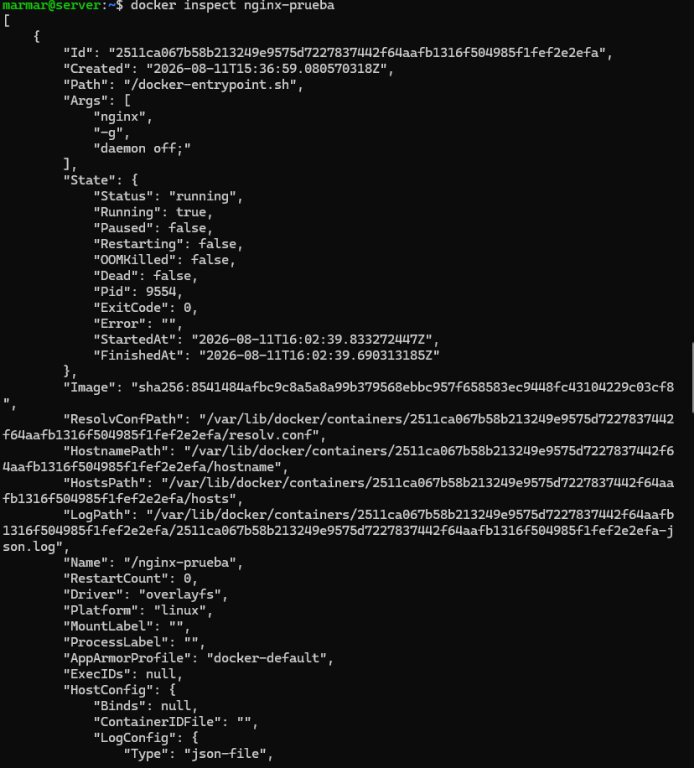
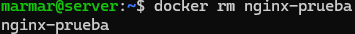

# despliegue-app

**Captura 1:** Tabla o documento con la arquitectura tecnológica seleccionada.
   
| Componente    | Tecnología        | Puerto | Función             |
| ------------- | ----------------- | -----: | ------------------- |
| Frontend      | React             |   8081 | Interfaz de usuario |
| Backend       | Java + Springboot |   8080 | API REST            |
| Base de datos | PostgreSQL        |   5439 | Persistencia        |

**Captura 2:** Información del servidor Linux.

**Captura 3:** Dirección IP de la máquina virtual.

**Captura 4:** Docker funcionando correctamente.

**Captura 5:** Primer contenedor ejecutado.

**Captura 6:** Servicio web funcionando.

**Captura 7:** Administración de los contenedores.

**Captura 8:** Portainer funcionando.

**Captura 9:** Administración del entorno Docker desde Portainer.
**Captura 10:** Volumen creado.

**Captura 11:** Prueba de persistencia.
**Captura 12:** Dockerfile del frontend.

**Captura 13:** Imagen Docker construida.

**Captura 14:** Frontend funcionando dentro del contenedor.
**Captura 15:** Dockerfile del backend.

**Captura 16:** Imagen del backend.

**Captura 17:** Backend funcionando.
**Captura 18:** Contenedor de base de datos funcionando.

**Captura 19:** Base de datos creada.

**Captura 20:** Volumen asociado a la base de datos.
**Captura 21:** Configuración de conexión.

**Captura 22:** Operación de lectura.

**Captura 23:** Operación de escritura.

**Captura 24:** Logs mostrando comunicación exitosa.
**Captura 25:** Frontend funcionando.

**Captura 26:** Solicitud del frontend hacia el backend.

**Captura 27:** Respuesta recibida desde el backend.
**Captura 28:** Aplicación completa funcionando.
**Captura 29:** Archivo Docker Compose.

**Captura 30:** Todos los servicios funcionando.
**Captura 31:** Servicios detenidos.

**Captura 32:** Servicios recuperados.

**Captura 33:** Servicios reconstruidos.
**Captura 34:** Aplicación funcionando desde el equipo anfitrión.

**Captura 35:** Aplicación funcionando desde otro equipo de la intranet.
