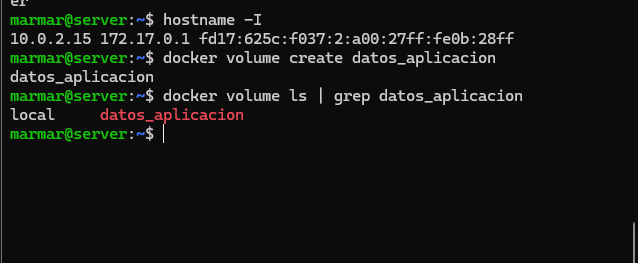

# despliegue-app

4. Actividad 1 — Selección de la arquitectura tecnológica
   
| Componente    | Tecnología        | Puerto | Función             |
| ------------- | ----------------- | -----: | ------------------- |
| Frontend      | React             |   8081 | Interfaz de usuario |
| Backend       | Java + Springboot |   8080 | API REST            |
| Base de datos | PostgreSQL        |   5439 | Persistencia        |

